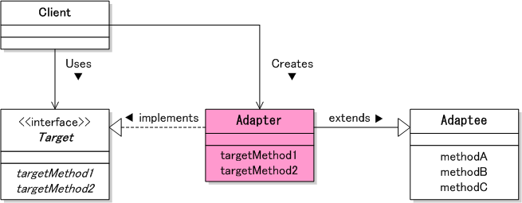
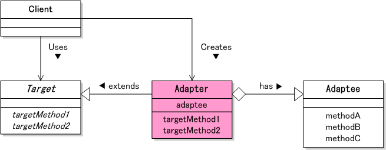

# Adapter パターン
このパターンは、「すでに提供されているもの」と「必要なもの」の間の「ずれ」を埋めるパターン。  
Adapterパターンは、2種類ある。

- クラス（継承）によるAdapterパターン（is a 関係）
- インスタンス（委譲）によるAdapterパターン（has a 関係）

## クラス（継承）によるAdapterパターン（is a 関係）

| 役割 | サンプル |
|:----|:--------|
|提供されているもの|Adapteeクラス|
|変換装置|Adapterクラス|
|必要なもの|Targetインターフェース|

### Targetインターフェース
必要とされているインターフェース

### Adapteeクラス
あらかじめ提供されているクラス

### Adapterクラス
このクラスがアダプターの役割をする。  
あらかじめ提供されているAdapteeクラスを継承して、要求されているTargetインターフェースを実装する。

### Client(index.php)
アダプター役のAdapterクラスのオブジェクトを生成し、Targetインターフェースで宣言されたメソッドを呼び出す。

## インスタンス（委譲）によるAdapterパターン（has a 関係）

ClientとAdapteeクラスは、継承によるパターンと同じ。  
しかし、Targetインターフェースが抽象クラスになっている。

### Targetクラス
必要とされているものを抽象クラスで定義する。

### Adapterクラス
Targetクラスを継承し、フィールドでAdapteeクラスのインスタンスを保持する。  
このインスタンスは、コンストラクタで生成する。  
抽象クラスで要求されているメソッドをフィールド経由でAdapteeのメソッドを呼び出す。
