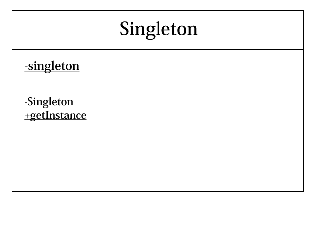

# Singletonパターン
このパターンは、あるクラスのインスタンスが一つしかない唯一の存在を保証するためのパターン。  
このパターンは、コンストラクタをprivateにすることで、他クラスから新たにインスタンスが生成されないように制御する。

## Singletonクラス
フィールドに自身のインスタンスを持たせてprivateにして、getInstanceメソッドを経由して、インスタンスを取得するようにする。  
コンスタラクタもprivateにして、外からの呼び出しを制御する。

## まとめ
インスタンスを1つしか生成したくないときに、使えるパターン。  
例えば、システムやサービスの設定など。