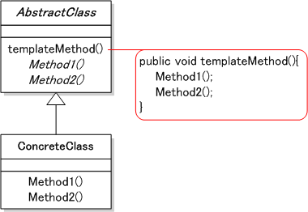

# Template Methodパターン
スーパークラスの方にテンプレートとなるメソッドが抽象メソッドとして宣言されている。  
スーパークラスは、抽象メソッドをどのように呼び出しているのかを書いているだけで、具体的な処理は、サブクラスに任せています。  
サブクラスでは具体的な処理を書いて、大まかな処理な流れはスーパークラスで組み立てている。  

## AbstractClass
テンプレートメソッドを実装する。  
また、テンプレートメソッドで使っている抽象メソッドも宣言しておく。  
この抽象メソッドは、サブクラスのConcreteClassで実装する。

## ConcreteClass
AbstractClassで宣言された抽象メソッドを実装する。  
この実装したメソッドは、AbstractClassのテンプレートメソッドから呼び出される。

## Client
mainの処理からは、スーパークラスに書かれている
***templateMethodメソッド***を呼び出す。  

## まとめ
メリットは、ロジックを共通化できること。  
似て非なるクラスを共通化することで、保守しやすくなる。

